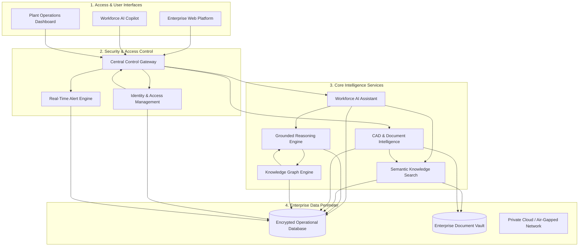

# Athleia.ai — Enterprise Industrial Knowledge Intelligence Platform

Athleia.ai unifies complex engineering documents, standard operating procedures (SOPs), equipment maintenance logs, compliance standards, and operational knowledge into a single intelligent enterprise platform. 

It empowers industrial workforces with instant knowledge search, grounded AI reasoning, safety compliance insights, and predictive maintenance intelligence.

🔗 **Live Platform Demo**: [Athleia.ai Live Demo](https://main.d3eih13i37l72p.amplifyapp.com/)

---

## Services & Products Provided

Athleia.ai delivers an end-to-end suite of enterprise AI services tailored for industrial plant operations:

### 1. Workforce Copilot (AI Plant Assistant)
* **What it does**: Provides field technicians, operators, and engineers with an interactive AI assistant for real-time equipment troubleshooting, maintenance guidance, and procedural queries.
* **Value**: Reduces Mean Time to Repair (MTTR) and prevents human operational errors in plant workflows.

### 2. Grounded AI Reasoning & Verification Engine
* **What it does**: Cross-references every AI insight and decision recommendation against official internal manuals, safety procedures, and technical specifications.
* **Value**: Delivers zero-hallucination, verified operational answers with direct document source citations.

### 3. CAD & Technical Document Intelligence Pipeline
* **What it does**: Automatically ingests, parses, and converts complex P&ID engineering schematics, CAD drawings, ISO compliance standards, and legacy paper manuals into structured digital intelligence.
* **Value**: Unlocks buried legacy engineering knowledge and makes paper documentation instantly searchable.

### 4. Industrial Knowledge Graph & Asset Relationship Mapping
* **What it does**: Maps complex relationships between industrial machinery, component hierarchies, sub-assemblies, and failure dependencies across the enterprise.
* **Value**: Visualizes equipment impact analysis and accelerates root-cause failure investigations.

### 5. Safety Compliance & Audit Automation Engine
* **What it does**: Continuously monitors plant operations against regulatory standards (OSHA, ISO 27001, safety guidelines) and generates automated compliance audit reports.
* **Value**: Eliminates manual compliance audits and protects facilities from regulatory non-conformance penalties.

### 6. Predictive Maintenance & Asset Telemetry Intelligence
* **What it does**: Tracks Mean Time Between Failures (MTBF), sensor telemetry trends, historical breakdown patterns, and component wear to forecast equipment failure risks.
* **Value**: Prevents unplanned operational downtime and extends heavy industrial machinery lifespan.

---

## High-Level System Architecture

---

## Flexible Enterprise Deployment

Athleia.ai is containerized using open standards, allowing seamless deployment across any infrastructure model:

* **Public Cloud**: AWS, Google Cloud Platform (GCP), Microsoft Azure.
* **Private Cloud / Enterprise VPC**: Fully isolated virtual private cloud environments.
* **Air-Gapped On-Premise**: 100% offline local plant server deployment for sovereign or high-security facilities.

---

## Contact & Support

For platform inquiries, security disclosures, or enterprise demonstration access:
* **Contact Email**: `musaqureshi0000@gmail.com`
* **Live Demo**: [https://main.d3eih13i37l72p.amplifyapp.com/](https://main.d3eih13i37l72p.amplifyapp.com/)

Copyright © 2026 Athleia.ai. All rights reserved.
